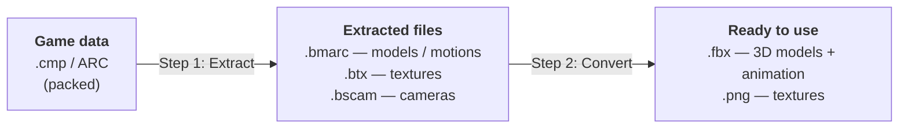
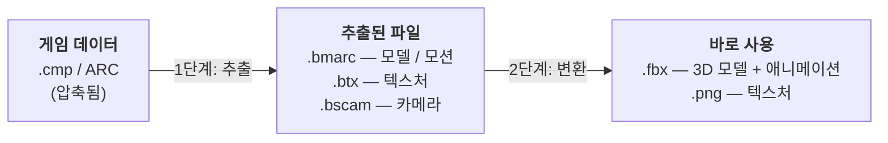

# Love Live! SIFAC Toolkit

Tools to pull the **3D models, textures, animations, cameras and stages** out of
*Love Live! School idol festival ~after school ACTIVITY~* (SIFAC, PS4 & Arcade)
and turn them into files you can open in everyday 3D software.

**한국어 안내는 아래 [한국어](#한국어) 섹션에 있습니다.**

---

## What you get

The game stores everything in its own packed-up format. This toolkit unpacks it
in two easy steps and hands you standard files:



The final **FBX + PNG** files open directly in **Blender, Unity, Unreal and
Maya** — no special plugins required. This is *not* an MMD (PMX/VMD) export; it
is the standard format used across the 3D industry.

> **New in this version:** a friendly desktop app (the "Toolbox") and a set of
> command-line tools live in the [`tools/`](tools/) folder. They do everything
> **without Noesis and without compiling anything** on most setups. The older
> Noesis-plugin route still works and is described further down.

---

## The easy way — the Toolbox app

A small desktop app with **two tabs** that walks you through both steps. The
interface is in **English by default**, with a one-click **한국어 (Korean)**
toggle in the top-right corner.

| | |
|---|---|
| **Tab 1 · Extract** | Game files → models / textures / motions |
| **Tab 2 · Convert** | Those files → ready-to-use **FBX + PNG** |

### 1. Get Python

Python 3 is the free program that runs the toolkit.

- **macOS:** install Python 3 from <https://www.python.org> (its installer
  already includes the windowing library the app needs), or run
  `brew install python python-tk`.
- **Windows:** install Python 3 from <https://www.python.org> (tick *"Add
  Python to PATH"* during setup).

### 2. Open the app

- **macOS:** double-click **`tools/run_mac.command`** in Finder.
  (The first time, macOS may block it — right-click → **Open**.)
- **Windows:** double-click **`tools/run_windows.bat`**.
- **Anything else:** run `python3 tools/sifac_gui.py`.

### 3. Extract, then Convert

1. On the **Extract** tab, pick your game-data folder and an output folder, then
   press start. The easiest setting is **"extract without QuickBMS"** (a
   built-in, pure-Python engine — nothing to download or compile).
2. On the **Convert** tab, point it at what you just extracted and press start to
   get **FBX + PNG**.

That's it. Progress bars and a live log show what's happening, and a **Stop**
button cancels at any time.

📖 **Full step-by-step guide, every option, and troubleshooting:
[`tools/README.md`](tools/README.md).**

---

## For power users — the command line

The app is just a front-end; the same engines run from a terminal and process a
whole folder in parallel (`-j` sets how many run at once):

```bash
# Step 1 — extract a whole folder, 8 jobs at a time.
# Add --native to skip QuickBMS entirely (pure Python, nothing to compile).
python3 tools/sifac_extract.py /game/data /output -j 8 --native

# Step 2 — convert the extracted files into FBX + PNG, 8 jobs at a time.
python3 tools/sifac_convert.py /output/02_extracted /fbx_output -j 8

# Convert just one kind of thing:
python3 tools/sifac_convert.py IN OUT --preset models      # models / stages
python3 tools/sifac_convert.py IN OUT --preset animations  # motions only
python3 tools/sifac_convert.py IN OUT --preset cameras     # cameras only
python3 tools/sifac_convert.py IN OUT --preset textures    # textures only
```

A couple of things worth knowing:

- **Two FBX engines.** The default **`python`** engine needs no installation,
  is fast, and brings characters in upright at roughly real-world size in
  Blender, Unity and Maya. If you specifically want Blender's own bone
  orientation, install Blender's Python module (`pip install bpy`) and add
  `--engine blender`.
- **Up axis.** Output is **Y-up by default** (`--up-axis y`), matching SIFAS,
  Maya and Unity; pass `--up-axis z` for Blender's native Z-up files. Both
  stand upright in Blender.
- **High-end textures.** Common texture formats decode with no extra software.
  The advanced BC7/BC6H formats need `pip install texture2ddecoder`; without it,
  only those particular textures are skipped and everything else still converts.

Every flag is documented in [`tools/README.md`](tools/README.md).

---

## The classic way — the Noesis plugin

The original route, for people who already use [Noesis](https://richwhitehouse.com/index.php?content=inc_projects.php).
Copy `plugins/python/fmt_Blade_bmarc.py` into Noesis and it can open the
extracted `.bmarc` (models/motions), `.btx` (textures) and `.bscam` (cameras)
directly. Motions (`mot_*`) must be loaded together with their model so the
animation lands on the right skeleton.

Exporting MMD-style **VMD** animation needs the separate vmd module:
<https://github.com/h-kidd/noesis-vmd>

Plugin options (edit them at the top of the script):

| Option | What it does |
|--------|--------------|
| `printMatInfo` | Print extra material info from the model's shader file. |
| `exportVmd` | Export a VMD file for the loaded animation. |
| `pmxScale` | Scale used for VMD export (match the scale you used when importing your PMX model into PmxEditor). |

---

## A few terms, in plain language

| Term | Meaning |
|------|---------|
| **SIFAC** | *Love Live! School idol festival ~after school ACTIVITY~*, the game these files come from. |
| **FBX** | A standard 3D file (models + animation) that Blender, Unity, Unreal and Maya all understand. |
| **PNG** | A standard image file — here, the game's textures. |
| **QuickBMS** | A classic unpacking tool. This toolkit can use it, **or** its own built-in engine instead. |
| **Noesis** | A 3D model viewer/converter. Optional here — only needed for the classic route. |
| **MMD** | MikuMikuDance (PMX/VMD). The toolkit makes standard FBX **instead of** MMD files. |
| `.cmp` / `ARC` | The game's packed containers (what you start with). |
| `.bmarc` / `.btx` / `.bscam` | A model-or-motion / a texture / a camera, after extracting. |

---

## Requirements

- **Python 3.8+** — the toolkit uses only Python's standard library, so there is
  nothing extra to install for the core features. The desktop app needs Tkinter,
  which comes with the python.org and macOS system Python.
- **Optional:** `texture2ddecoder` (for BC7/BC6H textures) and `bpy` (only for
  the `blender` FBX engine).

Credits: SIFAC format work by Minmode; Noesis VMD module by
[h-kidd](https://github.com/h-kidd/noesis-vmd).

---
---

# 한국어

*Love Live! School idol festival ~after school ACTIVITY~* (SIFAC, PS4·아케이드)
에서 **3D 모델·텍스처·애니메이션·카메라·무대**를 꺼내, 일반 3D 프로그램에서
바로 열 수 있는 파일로 만들어 주는 도구 모음입니다.

## 무엇을 얻나요

게임은 모든 데이터를 자체 포맷으로 꽁꽁 묶어 저장합니다. 이 도구는 그것을 **두
단계**로 풀어, 표준 파일로 돌려줍니다.



최종 결과물인 **FBX + PNG**는 **Blender·Unity·Unreal·Maya**에서 별도 플러그인
없이 바로 열립니다. 이것은 MMD(PMX/VMD)가 *아니라*, 3D 업계 어디서나 쓰는
표준 포맷입니다.

> **이번 버전의 새 기능:** 누구나 쉽게 쓰는 데스크톱 앱("툴박스")과 명령줄
> 도구들이 [`tools/`](tools/) 폴더에 들어 있습니다. 대부분의 환경에서 **Noesis
> 없이, 그리고 아무것도 컴파일하지 않고** 동작합니다. 기존 Noesis 플러그인
> 방식도 그대로 쓸 수 있으며, 아래에 설명합니다.

---

## 쉬운 방법 — 툴박스 앱

두 단계를 차례로 안내하는 **두 개의 탭**으로 된 작은 데스크톱 앱입니다. 화면은
**기본이 영어**이고, 오른쪽 위의 **한국어** 버튼을 한 번 누르면 창 전체가 바로
한국어로 바뀝니다.

| | |
|---|---|
| **1번 탭 · 추출(Extract)** | 게임 파일 → 모델 / 텍스처 / 모션 |
| **2번 탭 · 변환(Convert)** | 그 파일들 → 바로 쓰는 **FBX + PNG** |

### 1. 파이썬 준비

파이썬(Python) 3은 이 도구를 실행하는 무료 프로그램입니다.

- **macOS:** <https://www.python.org> 에서 Python 3 설치본을 받으세요(앱에
  필요한 창 라이브러리가 함께 들어 있습니다). 또는 `brew install python python-tk`.
- **Windows:** <https://www.python.org> 에서 Python 3을 설치하세요(설치 중
  *"Add Python to PATH"* 를 체크).

### 2. 앱 열기

- **macOS:** Finder에서 **`tools/run_mac.command`** 를 더블클릭.
  (처음엔 macOS가 막을 수 있어요 → 우클릭 → **열기**.)
- **Windows:** **`tools/run_windows.bat`** 를 더블클릭.
- **그 외:** `python3 tools/sifac_gui.py` 실행.

### 3. 추출하고, 변환하기

1. **추출** 탭에서 게임 데이터 폴더와 저장할 폴더를 고르고 시작을 누르세요. 가장
   쉬운 설정은 **"QuickBMS 없이 추출"** 입니다(내장된 순수 파이썬 엔진 — 받거나
   컴파일할 것이 없습니다).
2. **변환** 탭에서 방금 추출한 폴더를 가리키고 시작을 누르면 **FBX + PNG**가
   나옵니다.

끝입니다. 진행률 막대와 실시간 로그로 상태를 볼 수 있고, **중지** 버튼으로
언제든 취소할 수 있습니다.

📖 **단계별 자세한 안내, 모든 옵션, 문제 해결은
[`tools/README.md`](tools/README.md) 에 있습니다.**

---

## 잘 아는 분이라면 — 명령줄(CLI)

앱은 겉모습일 뿐, 같은 엔진을 터미널에서도 쓸 수 있고 폴더 전체를 **동시에**
처리합니다(`-j` 로 동시 실행 개수 지정).

```bash
# 1단계 — 폴더 전체를 8개 동시 작업으로 추출.
# --native 를 붙이면 QuickBMS가 아예 필요 없습니다(순수 파이썬, 컴파일 불필요).
python3 tools/sifac_extract.py /게임데이터 /출력 -j 8 --native

# 2단계 — 추출 결과를 FBX + PNG로, 8개 동시 작업.
python3 tools/sifac_convert.py /출력/02_extracted /fbx출력 -j 8

# 한 종류만 변환하기:
python3 tools/sifac_convert.py IN OUT --preset models      # 모델 / 무대
python3 tools/sifac_convert.py IN OUT --preset animations  # 모션만
python3 tools/sifac_convert.py IN OUT --preset cameras     # 카메라만
python3 tools/sifac_convert.py IN OUT --preset textures    # 텍스처만
```

알아두면 좋은 점:

- **FBX 엔진 두 가지.** 기본 **`python`** 엔진은 설치가 필요 없고 빠르며,
  Blender·Unity·Maya에서 캐릭터가 실제 크기에 가깝게 똑바로 들어옵니다. Blender
  고유의 본(뼈) 방향을 그대로 쓰고 싶다면 Blender 파이썬 모듈을 설치(`pip
  install bpy`)하고 `--engine blender` 를 붙이세요.
- **Up 축.** 출력은 **기본 Y-up**(`--up-axis y`)으로, SIFAS·Maya·Unity와 같은
  방향입니다. Blender 고유의 Z-up 파일이 필요하면 `--up-axis z`. 둘 다 Blender
  에서 똑바로 섭니다.
- **고급 텍스처.** 일반 텍스처 포맷은 추가 설치 없이 풀립니다. 고급 BC7/BC6H
  포맷은 `pip install texture2ddecoder` 가 필요하며, 없으면 **그 텍스처만**
  건너뛰고 나머지는 모두 정상 변환됩니다.

모든 옵션은 [`tools/README.md`](tools/README.md) 에 정리돼 있습니다.

---

## 전통적인 방법 — Noesis 플러그인

[Noesis](https://richwhitehouse.com/index.php?content=inc_projects.php)를 이미
쓰는 분을 위한 기존 방식입니다. `plugins/python/fmt_Blade_bmarc.py` 를 Noesis에
넣으면 추출된 `.bmarc`(모델/모션)·`.btx`(텍스처)·`.bscam`(카메라)를 바로 열 수
있습니다. 모션(`mot_*`)은 본에 제대로 적용되도록 같은 모델과 함께 불러와야
합니다.

MMD용 **VMD** 애니메이션 내보내기에는 별도의 vmd 모듈이 필요합니다:
<https://github.com/h-kidd/noesis-vmd>

플러그인 옵션(스크립트 맨 위에서 수정):

| 옵션 | 의미 |
|------|------|
| `printMatInfo` | 모델 셰이더 파일에서 추가 머티리얼 정보를 출력. |
| `exportVmd` | 불러온 애니메이션을 VMD 파일로 내보내기. |
| `pmxScale` | VMD 내보내기에 쓰는 스케일(PmxEditor에서 PMX 모델을 임포트할 때 쓴 스케일과 같게 맞추세요). |

---

## 용어 풀이

| 용어 | 뜻 |
|------|----|
| **SIFAC** | *Love Live! School idol festival ~after school ACTIVITY~*. 이 파일들이 나오는 게임. |
| **FBX** | Blender·Unity·Unreal·Maya가 모두 이해하는 표준 3D 파일(모델 + 애니메이션). |
| **PNG** | 표준 이미지 파일 — 여기서는 게임 텍스처. |
| **QuickBMS** | 오래된 압축 해제 도구. 이 툴은 이걸 쓸 수도, **자체 내장 엔진**을 쓸 수도 있습니다. |
| **Noesis** | 3D 모델 뷰어/변환기. 여기선 선택 사항으로, 전통적 방식에서만 필요합니다. |
| **MMD** | MikuMikuDance(PMX/VMD). 이 툴은 MMD 대신 표준 FBX를 만듭니다. |
| `.cmp` / `ARC` | 게임의 압축 컨테이너(시작점). |
| `.bmarc` / `.btx` / `.bscam` | 추출 후의 모델/모션 · 텍스처 · 카메라. |

---

## 요구 사항

- **Python 3.8 이상** — 핵심 기능은 파이썬 표준 라이브러리만 사용하므로 추가
  설치가 없습니다. 데스크톱 앱은 Tkinter가 필요한데, python.org 설치본과 macOS
  기본 파이썬에 포함돼 있습니다.
- **선택:** `texture2ddecoder`(BC7/BC6H 텍스처용), `bpy`(`blender` FBX 엔진을
  쓸 때만).

만든 사람: SIFAC 포맷 분석 Minmode, Noesis VMD 모듈
[h-kidd](https://github.com/h-kidd/noesis-vmd).
